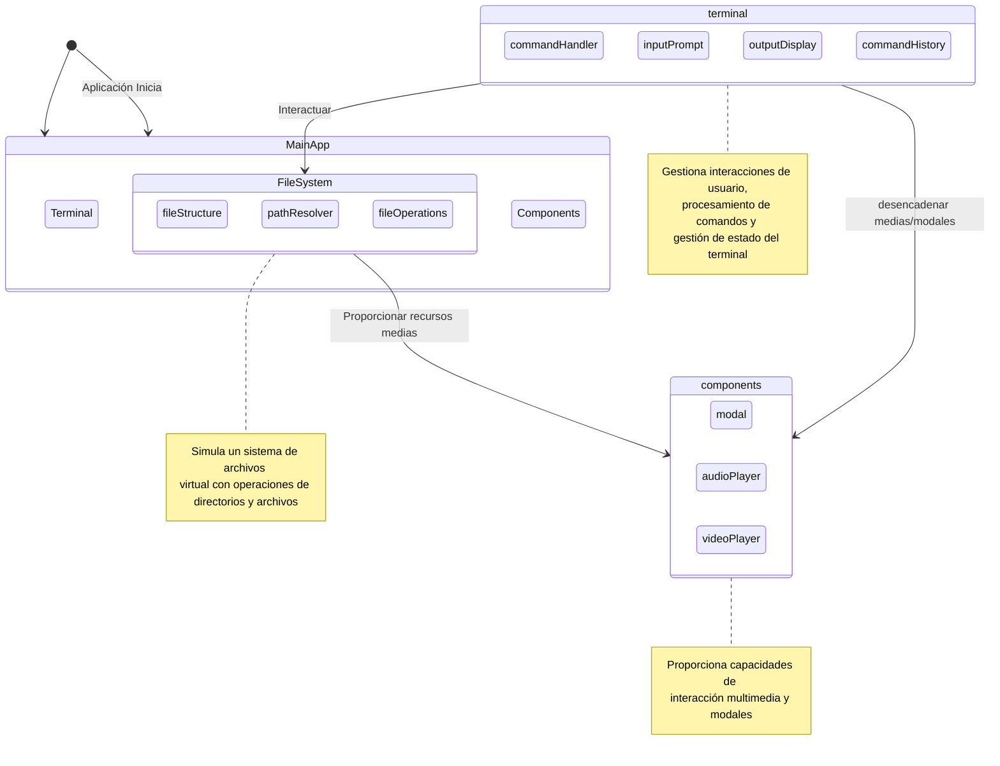

# Simulador de Terminal Linux

[](/README.md) [](/README.es.md)

Una herramienta sofisticada para mejorar tu experiencia con la terminal Linux a través del aprendizaje interactivo y el descubrimiento de comandos.

[](https://opensource.org/licenses/MIT)
[](https://github.com/bniladridas/whitehatgazette)
[](https://github.com/bniladridas/whitehatgazette)
[](https://github.com/bniladridas/whitehatgazette/graphs/commit-activity)
[](https://whitehatgazette.vercel.app)

### Fecha y Hora Actual (UTC):
2024-12-11 21:15:44

### Usuario de GitHub:
bniladridas

## Comandos Disponibles

- `ls`: Listar contenido del directorio
- `pwd`: Imprimir directorio de trabajo
- `date`: Mostrar fecha y hora actual
- `help`: Mostrar mensaje de ayuda con comandos disponibles
- `echo`: Mostrar una línea de texto, admite variables de entorno
- `history`: Mostrar historial de comandos
- `clear`: Limpiar la pantalla del terminal
- `cd`: Cambiar de directorio
- `cat`: Mostrar contenido del archivo
- `rm`: Simular un comando de eliminación con una respuesta humorística
- `open-image`: Abrir un archivo de imagen
- `play-audio`: Reproducir un archivo de audio
- `play-video`: Reproducir un archivo de video
- `man`: Sugerir el uso del comando `help` para ver comandos disponibles

## Badges

[](https://developer.mozilla.org/en-US/docs/Web/HTML)
[](https://developer.mozilla.org/en-US/docs/Web/CSS)
[](https://developer.mozilla.org/en-US/docs/Web/JavaScript)
[](https://reactjs.org/)
[](https://astro.build/)

## Licensing and Community

[](https://github.com/bniladridas/whitehatgazette/blob/main/CONTRIBUTING.md)
[](https://github.com/bniladridas/whitehatgazette/pulls)

## Platform Compatibility

[](https://www.microsoft.com/windows)
[](https://www.apple.com/macos)
[](https://www.linux.org/)

## Community Engagement

[](https://github.com/bniladridas/whitehatgazette/stargazers)
[](https://github.com/bniladridas/whitehatgazette/network)
[](https://github.com/bniladridas/whitehatgazette/issues)


🔧 **Tecnologías Utilizadas**

- **HTML5**: Estructura y contenido de la página web.
- **CSS3**: Estilos y diseño visual.
- **JavaScript**: Interactividad y funcionalidad.
- **Astro**: Framework frontend para construir sitios web rápidos y eficientes.
- **React**: Biblioteca de JavaScript para construir interfaces de usuario.

📖 **Propósito del Proyecto**

El **Simulador de Terminal Linux** es una herramienta interactiva diseñada para que los usuarios puedan explorar y aprender sobre el uso de la terminal Linux en un entorno seguro y controlado. Con la guía de **White Hat Gazette**, este simulador permite a los principiantes y expertos descubrir comandos esenciales y navegar como si estuvieran en una consola real.

### Características Principales

- **Interactividad**: Simula una terminal Linux real en el navegador.
- **Comandos Útiles**: Proporciona una lista de comandos esenciales y explicaciones detalladas.
- **Guía de Aprendizaje**: Incluye tutoriales y ejemplos prácticos para facilitar el aprendizaje.
- **Diseño Responsivo**: Funciona en dispositivos móviles y de escritorio.

### Arquitectura del Sistema

#### Descripción General de la Arquitectura

El Simulador de Terminal Linux está construido con una arquitectura modular e interactiva diseñada para proporcionar una experiencia completa de emulación de terminal. El sistema se compone de varios módulos clave:

1. **Núcleo de Terminal**
    - Gestiona el procesamiento de comandos
    - Maneja la entrada de usuario e historial de comandos
    - Renderiza la salida del terminal
    - Administra el estado y navegación del terminal

2. **Simulación de Sistema de Archivos**
    - Crea un sistema de archivos virtual
    - Admite operaciones de directorios y archivos
    - Proporciona resolución de rutas y recuperación de contenido

3. **Componentes Interactivos**
    - Sistema de modal para visualización de imágenes
    - Reproductor de audio para archivos de sonido
    - Reproductor de video para contenido multimedia

#### Diagrama de Arquitectura



### Interacciones de Módulos

- **Módulo de Terminal**: Componente central que procesa comandos, gestiona entrada/salida y mantiene el historial de comandos
- **Módulo de Sistema de Archivos**: Simula un sistema de archivos completo con directorios y archivos virtuales
- **Componentes Interactivos**: Proporcionan funcionalidad adicional como reproducción de imagen, audio y video

### Cómo Usar

1. **Clona el Repositorio**:
    ```bash
    git clone https://github.com/bniladridas/whitehatgazette.git
    ```

2. **Instala las Dependencias**:
    ```bash
    cd whitehatgazette
    npm install
    ```

3. **Inicia el Servidor de Desarrollo**:
    ```bash
    npm run dev
    ```

4. **Accede al Simulador**:
    Abre tu navegador y visita http://localhost:3000.

### Contribuciones

¿Quieres contribuir? ¡Genial! Sigue estos pasos:

1. **Fork el repositorio**.
2. **Crea una nueva rama con tu funcionalidad o corrección**:
    ```bash
    git checkout -b nueva-funcionalidad
    ```
3. **Haz commit de tus cambios**:
    ```bash
    git commit -m "Añade nueva funcionalidad"
    ```
4. **Sube a tu rama**:
    ```bash
    git push origin nueva-funcionalidad
    ```
5. **Crea un Pull Request**.

### Licencia

Este proyecto está licenciado bajo la Licencia MIT. Consulta el archivo LICENSE para más detalles.

### Contacto

¿Necesitas más información o soporte? Contacta con:

- **Nombre**: NILADRI DAS
- **Correo Electrónico**: [dasniladri874@gmail.com][def]
- **Sitio Web**: https://whitehatgazette.vercel.app

### Agradecimientos

- A la comunidad de desarrolladores de Astro y React por sus increbles herramientas.
- A todos los usuarios y contribuyentes que han hecho este proyecto posible.

**White Hat Gazette** es una marca registrada. Todos los derechos reservados.

[def]: mailto:dasniladri874@gmail.com

---